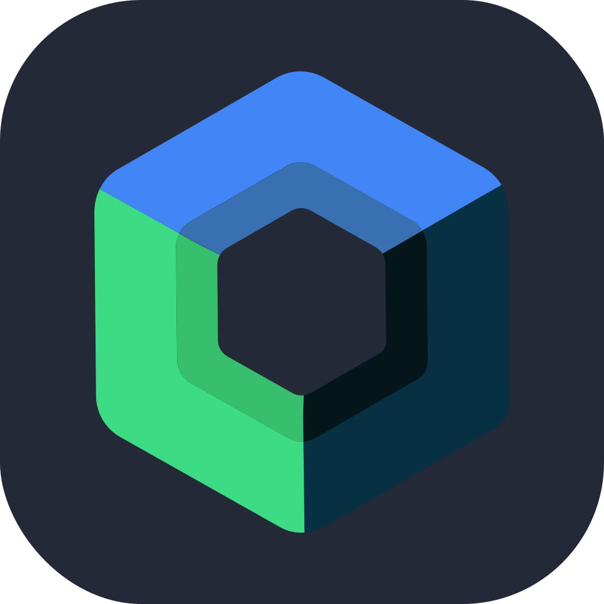

## Hi, I'm full-stack developer :v:

:page_facing_up: Currently exploring **AV** bypass techniques and fingerprinting

:milky_way: Enjoy building cool things, discovering, inventing and analysing different protocols and algorithms

### Programming languages

<b>..also</b>

### Stack

### System software

### Other

### Projects in which I participated :zap:

[Midday][4] — Midday provides you with greater insight into your business and automates the boring tasks, allowing you to focus on what you love to do instead.

[ReVanced][1] — :pill: Continuing the legacy of Vanced 

[Telegraf][2] — Modern Telegram Bot Framework for Node.js

[NextUI][3] — :rocket: Beautiful, fast and modern React UI library

### Still have questions?

    

[1]: https://github.com/revanced
[2]: https://github.com/telegraf/telegraf
[3]: https://github.com/nextui-org/nextui
[4]: https://midday.ai/
